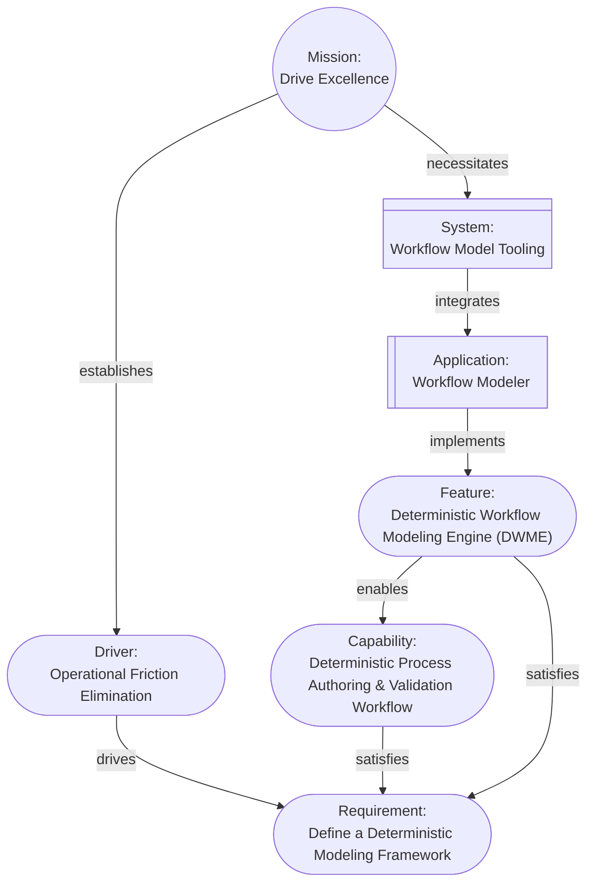
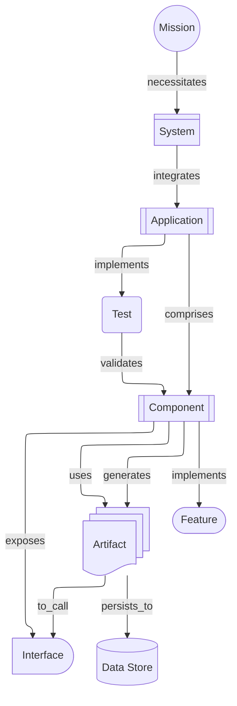
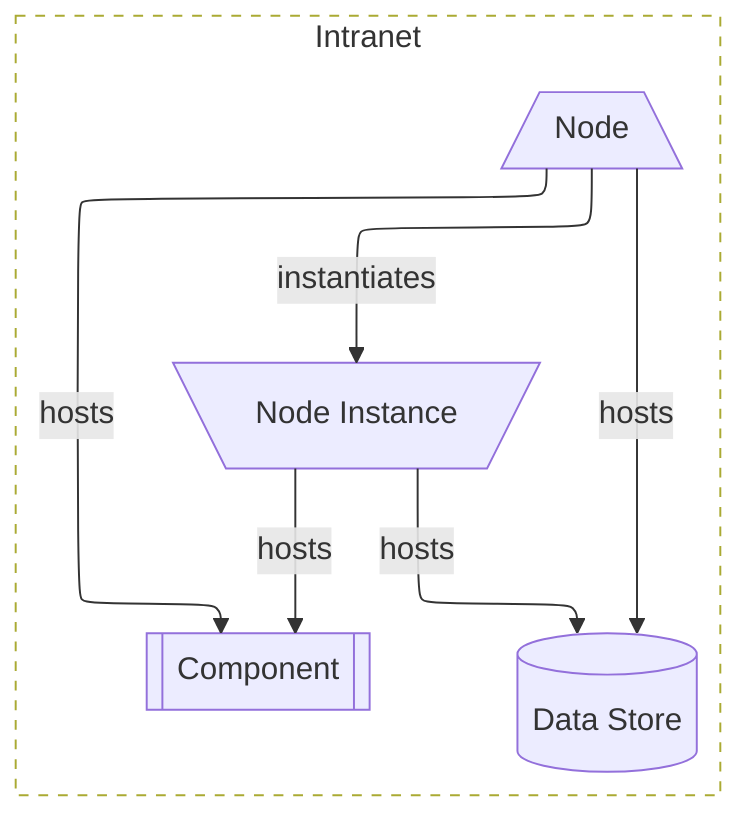
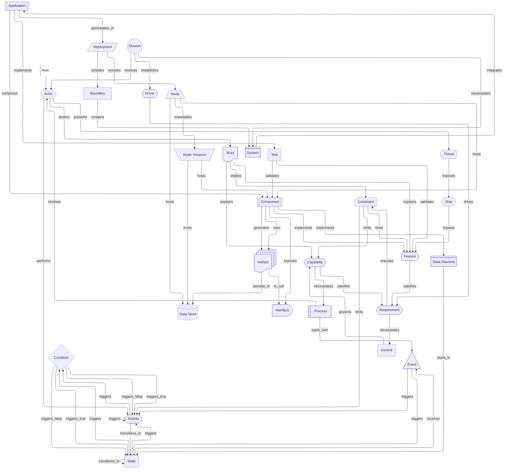
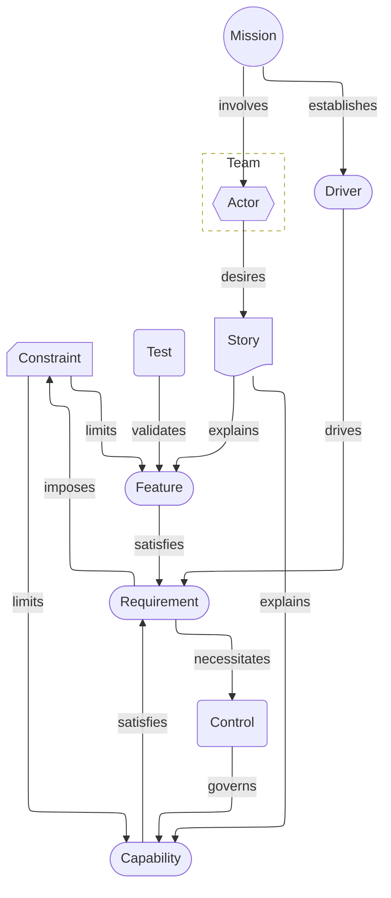
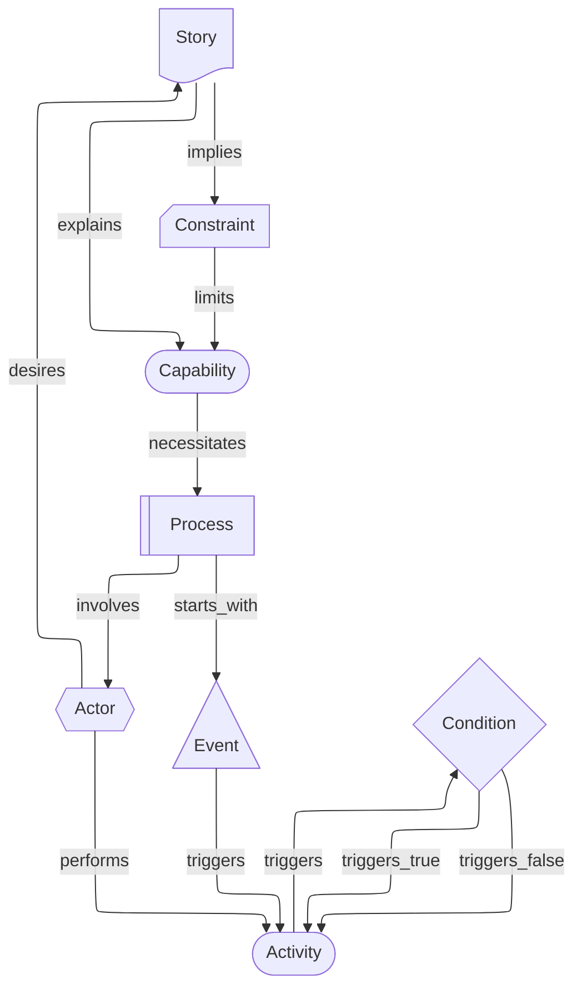

# Aurora Machine Agent Instruction

## Model Overview

**Version**: 2.0.0

Aurora is a deterministic architectural model where architectural elements are cards, the relationships between cards are represented as links, and the model forms a Directed Graph. The model is designed so that any interpretation, such as view diagrams, can be generated from the model; and for direct machine consumption by LLMs, agents, reasoners, and automated tools. The model invariants guarantee unambiguous interpretation and reasoning about the model.

**One Goal**: Enable the Architect to focus on modeling the architecture instead of drawing diagrams and pictures.

## Models

The model is the central piece of the architecture and is a collection of cards that have links describing their relationships, starting from a `Mission`. Cards represent the elements of the design, described as nouns. Links represent how the elements interact, and are tagged with verbs (for human convenience).

Any pair of cards in the model can be described using simple sentences:

**Examples**:

```text
The mission "Drive Excellence" is "Drive excellence in operations by streamlining processes, integrating automation, and formalizing documentation".

The mission establishes the driver "Operational Friction Elimination" which is "Eliminate non-value-adding manual effort by enforcing end-to-end process automation, standardized workflows, and machine-verifiable documentation across all operational domains".

"Operational Friction Elimination" drives the requirement "Define a Deterministic Modeling Framework" which is "Design a framework for documenting deterministic process models with measurable latency and failure semantics".

The capability "Deterministic Process Authoring & Validation Workflow" which is "A machine-verifiable, executable representation of every operational workflow with deterministic guarantees" satisfies the requirement "Define a Deterministic Modeling Framework".

The feature "Deterministic Workflow Modeling Engine (DWME)" which is "Software tools to create, manage, and render machine-verifiable executable representations of operational workflows" satisfies the requirement "Define a Deterministic Modeling Framework" and enables the capability "Deterministic Process Authoring & Validation Workflow".

The mission necessitates the system "Workflow Model Tooling" which integrates the application "Workflow Modeler".

Workflow Modeler implements the feature "Deterministic Workflow Modeling Engine".
```

**These result in a model that looks like this**:



### Cards

A card contains the information about an element of the model and the links to other elements. The cards themselves and the links between them do not encode semantic meaning (see [Invariant Rules](#invariant-rules)). Cards also have an `attributes` property that allows additional, arbitrary information to be included. Card files should be "pretty printed" using `prettier`.

Each card is comprised of:

<<<<<<< Updated upstream
- `uuid` - A unique identifier (UUID v4 or v7) that never changes for the life of the card
- `id` - A short, machine-friendly name for the card in snake case
- `card_type` - The architectural type represented by the card in snake case
- `card_subtype` - An optional refinement of the `card_type`, for example a `boundary` card may have the `card_subtype` `domain`, `vlan`, etc.
- `name` - A concise human-readable name for the card
- `description` - Details regarding the element the card represents
- `version` - semver version of the particular card, updated whenever the card changes; revision increments for minor edits, minor increments for significant changes (e.g., description/links), and major increments for role changes (e.g., `id`, `card_type`, `card_subtype`)
- `status` - the status of an implementable element; one of: "proposed", "pending", "implementation", "review", "verified", "deprecated", "retired"; status transitions are not constrained beyond this set, but any change requires an audit entry and a version update
- `links` - pointers to other cards establishing relationships (`target` = destination `uuid`, `relationship` = verb describing the impact, "name" = "The human readable name of the target")
- `audit_history` - a record of created/edited/deleted events the card has been through (includes `event`, `user`, `timestamp`)
- `attributes` - Arbitrary, optional key-value pairs providing additional data; the value can be any valid JSON value, including objects.

Every card file must include a `"$schema"` field. Tooling should prefer a schema copy placed alongside the `mission` card for validation and portability.
=======
- `$schema` - the relative link to the Aurora schema file included with the model(s) in the model home.
- `id` - A unique identifier assigned to the card composed from a predefined prefix per `card_type` followed by a sequentially assigned integer per card type. If the model is extended, additional prefixes must also be issued for new card types. Once issued to a card the `id` MUST NOT change. If `card_type` changes, a new card should be issued and the original moved to the `status` "Deleted" with an appropriate audit history entry added. This enables traceability of the model over time.

**Example Names**:

- MIS-001
- DRI-001
- DRI-002
- REQ-001
- REQ-002

- `card_type` - The architectural element represented by the card in title case. See [Common Cards](#common-cards) for examples
- `card_subtype` - An optional refinement of the `card_type` in title case. See [Common Cards](#common-cards) for examples.
- `name` - A concise human-readable name for the card in title case
- `description` - Details regarding the element the card represents
- `status` - the status of an implementable element such as a `Feature`
	+ A common lifecycle is: "Proposed", "Backlog", "Design", "Implementation", "Review", "Pre-Release", "Released", "Deprecated", "Retired", "Deleted".
	+ Any other series of lifecycle states that make sense for the model may be used, as long as they are kept consistent per type across the model.
- `links` - pointers to other cards establishing relationships
	+ `target` - the destination card `id`
	+ `relationship` - verb describing the impact for human reference
- `audit_trail` - a record of the version and a history of the events (created/edited/deleted) the card has been through
	+ `version` - A semver version number for the card that is incremented when the card changes.
		* The major version is incremented for changes that alter the meaning or definition of the element, such as changing the `card_subtype`, updating the `name`, or adjusting the `description` in a way that changes meaning. The `status` moving to `Deleted` is also a major increment.
		* The minor version is incremented for changes that do not alter the element's definition, such as revising the phrasing of the `description` without changing meaning, or a change in `status` other than to "Deleted".
		* Insignificant changes, such as typographic or grammatical corrections, increase the patch version.
	+ `hash` - an optional SHA256 hash of the card with the hash temporarily set to `null` to calculate the hash
	+ `history` - an array of objects capturing the audit history of the card
		* `editor` - the identity of the entity making the change. Agents should use the name of their host (e.g. "Copilot") and, if acting as a particular role, a colon followed by a space and the agent role name, for example "Copilot: BackendDeveloper".
		* `timestamp` - the UTC time of the edit in RFC3339 format with millisecond resolution
		* `event` - the type of change event, one of: `created`, `edited`, `deleted`
- `attributes` - Arbitrary, optional key-value pairs providing additional data; the value can be any valid JSON value, including objects. See [Common Cards](#common-cards) for examples.
>>>>>>> Stashed changes

#### The Compressed Model

In order to make the model easier for implementing agents to process and save context space, a compressed model file may be generated named `{mission id}.agent.json` for agent reference in the model home that conforms to the `Aurora.compact.schema.json` in the model home.

The compressed file will have all of the cards in a top level array named `cards` and will have the `audit_trail` stripped from each. The compressed file may be "pretty printed" but that is not required.

#### Common Cards

The following list contains a set of common cards that can be used as a starting point. For convenience, approximate UML and SysML equivalents are included; Aurora is intentionally broader and more flexible than either standard, so these mappings are provided only as familiar analogies.

- `activity` - a unit of behavior performed by an `actor` (UML: Activity, SysML: Activity)
- `actor` - an external role that interacts with the system (UML: Actor, SysML: Actor)
- `application` - a runnable software product deployed to deliver features (UML: Component, SysML: Block)
- `artifact` - a tangible work product produced/consumed by the system, e.g., binary, document, or configuration (UML: Artifact, SysML: Artifact)
- `boundary` - a logical container defining a scope and grouping related model elements (UML: Package, SysML: Package/Block boundary)
- `capability` - an ability the organization or system can perform to achieve outcomes (UML: Use Case, SysML: Use Case (capability))
- `component` - a modular unit with clear responsibilities and explicit interfaces (UML: Component, SysML: Block)
- `condition` - a boolean predicate used as a guard for control flow or state transitions (UML: Guard, SysML: Guard)
- `constraint` - a rule or limit that restricts design or behavior (UML: Constraint, SysML: Constraint)
- `control` - a governance or assurance mechanism that enforces constraints (UML: Constraint/Comment, SysML: Requirement/Constraint)
- `data_store` - a persistent storage resource that holds data used by components (UML: Node «database», SysML: Block)
- `deployment` - a definition of the hosting topology and where software runs (UML: Deployment, SysML: Deployment)
- `driver` - a motivating concern that drives requirements and prioritization (UML: Comment/Rationale, SysML: Stakeholder concern/rationale)
- `event` - a discrete occurrence that triggers activities or state changes (UML: Signal/Trigger, SysML: Signal/Trigger)
- `feature` - a deliverable slice of functionality that satisfies requirements (UML: Use Case, SysML: Use Case)
- `interface` - a contract describing how a component is used or invoked (UML: Interface, SysML: Interface)
- `mission` - the root purpose and single entry point for the model (UML: Model/Package, SysML: stakeholder need / top-level requirement)
- `node_instance` - a concrete runtime instance of a `node` (UML: InstanceSpecification (Node), SysML: InstanceSpecification (Block/Node))
- `node` - a compute or hosting resource on which components and data stores run (UML: Node, SysML: Block)
- `note` - a non-structural annotation attached to another element; always a leaf (UML: Comment, SysML: Comment)
- `process` - an ordered set of activities describing how work is performed (UML: Activity, SysML: Activity)
- `requirement` - a testable need or constraint the system must satisfy (UML: Constraint/Comment (profiled as «requirement»), SysML: Requirement)
- `risk` - a potential adverse condition with likelihood/impact that may affect objectives (UML: Comment/Constraint «risk», SysML: Requirement/Constraint «risk»)
- `state_machine` - a lifecycle model of states and transitions for an element (UML: State Machine, SysML: State Machine)
- `state` - a distinct mode or condition within a lifecycle (UML: State, SysML: State)
- `story` - a user-centric narrative describing desired behavior or outcome (UML: Use Case (textual scenario), SysML: Use Case (textual scenario))
- `system` - a top-level solution boundary that integrates applications to deliver capabilities (UML: Component/Package, SysML: Block)
- `test` - a verification artifact that validates behavior, features, or requirements (UML: TestCase (via profile), SysML: TestCase)
- `threat` - an adversarial risk describing a potential attacker and their capability/intent (UML: Comment/Constraint «threat», SysML: Requirement/Constraint «threat»)

#### Common Relationships

Links are intentionally free-form; the `relationship` verb is descriptive for humans and does not encode semantic meaning by itself. The following relationships appear in the examples in this document and are recommended conventions for consistency:

- `contains` - used by `boundary` to indicate containment (structural membership)
- `includes` - used to indicate membership without containment (e.g., view/topology constructs like `deployment`, and associating a parent element with a `boundary` in a view)
- `establishes` - introduces a downstream motivation element (e.g., `mission` → `driver`)
- `drives` - indicates a motivating element influences a downstream need (e.g., `driver` → `requirement`)
- `satisfies` - indicates a downstream element fulfills a need (e.g., `capability`/`feature` → `requirement`)
- `enables` - indicates an element makes another feasible/possible (e.g., `feature` → `capability`)
- `necessitates` - indicates a higher-level goal requires an element to exist (e.g., `mission` → `system`)
- `integrates` - indicates a container/system pulls together sub-elements (e.g., `system` → `application`)
- `comprises` - indicates composition (e.g., `application` → `component`)
- `implements` - indicates an element realizes another (e.g., `component` → `feature`)
- `exposes` - indicates an element provides an interface (e.g., `component` → `interface`)
- `generates` - indicates an element produces an artifact (e.g., `component` → `artifact`)
- `uses` - indicates a dependency or consumption (e.g., `component` → `artifact`)
- `to_call` - indicates an invocation path (e.g., `artifact` → `interface`)
- `persists_to` - indicates persistence of an artifact to storage (e.g., `artifact` → `data_store`)
- `validates` - indicates a test verifies behavior (e.g., `test` → `component`/`feature`)
- `participates_in` - indicates involvement in a topology (e.g., `application` → `deployment`)
- `hosts` - indicates a runtime host relationship (e.g., `node`/`node_instance` → `component`/`data_store`)
- `instantiates` - indicates a node creates a runtime instance (e.g., `node` → `node_instance`)
- `involves` - indicates a process or mission includes an actor (e.g., `process`/`mission` → `actor`)
- `desires` - indicates an actor has a story/goal (e.g., `actor` → `story`)
- `performs` - indicates an actor executes an activity (e.g., `actor` → `activity`)
- `explains` - indicates a story elaborates on a capability/feature (e.g., `story` → `capability`)
- `implies` - indicates a story suggests a constraint (e.g., `story` → `constraint`)
- `starts_with` - indicates the first event of a process (e.g., `process` → `event`)
- `receives` - indicates a state receives an event (e.g., `state` → `event`)
- `starts_in` - indicates the initial state of a state machine (e.g., `state_machine` → `state`)
- `transitions_to` - indicates a transition edge (e.g., `state`/`activity` → `state`)
- `triggers` - indicates an event/activity triggers another element (e.g., `event` → `state`)
- `triggers_true` / `triggers_false` - indicates conditional branching outcomes (e.g., `condition` → `state`)
- `limits` - indicates a constraint bounds another element (e.g., `constraint` → `feature`)
- `governs` - indicates control/assurance applies to an element (e.g., `control` → `capability`)
- `presents` - indicates an actor presents a threat (e.g., `actor` → `threat`)
- `imposes` - indicates a threat introduces a risk (e.g., `threat` → `risk`)
- `impacts` - indicates a risk affects another element (e.g., `risk` → `feature`)

#### Special cards

##### The `mission` card

<<<<<<< Updated upstream
The root card of the model is _always_ a `mission` card. The `mission` card captures the overarching purpose and goal of the model. A given model must only have a single `mission` card. All paths must lead away from the `mission`.
=======
The root card of the model is _always_ a `Mission` card. The `Mission` card captures the overarching purpose and goal of the model.
>>>>>>> Stashed changes

##### The `boundary` card

<<<<<<< Updated upstream
The `boundary` card represents a logical grouping of other cards, in other words, they contain them. `boundary` cards frequently "contain" `system`, `application`, `node`, `process`, `state_machine`, and similar higher-level cards, and optionally their descendants. They are linked between a parent and the contained card, e.g., parent --> boundary --> contained, always in parallel to another link.

A `boundary` card may include an attribute named `recursive` (boolean, default false). If true, the boundary includes all descendants of `target` _in the current view_. Because the cards contained by a boundary may form local loops rendering engines have to be careful when traversing the descendants.
=======
The `Boundary` (BND) card represents a logical grouping of other cards, in other words, they contain them. For simplicity in the model, a parent card includes a `Boundary` and a boundary contains a link to a single target card; in order to represent complex boundaries, a `Boundary` card may include an attribute named `recursive` (boolean, default false). If true, the boundary includes all descendants of the contained card (the contains target) in the current view. Because the cards contained by a boundary may form local loops rendering engines have to be careful when traversing the descendants. `Boundary` cards frequently "contain" `System`, `Application`, `Node`, `Process`, `State Machine`, and similar higher-level cards, and optionally their descendants. They are linked between a parent and the contained card, e.g., parent -- includes --> `Boundary` -- contains --> target, always in parallel to another link.
>>>>>>> Stashed changes

When recursing, descendants are determined by link traversal and then filtered to only those cards included in the current view. Tooling should consider encountering a card previously traversed as a terminal point to prevent recursion.

**Example of a Boundary in a Model**:

```mermaid
<<<<<<< Updated upstream
---
config:
  layout: elk
---
=======
%%{init: {'flowchart': {'defaultRenderer': 'elk'}, 'themeVariables': { 'clusterBkg': 'transparent' }}}%%
>>>>>>> Stashed changes
graph LR
	a(A)
	boundary([Boundary])
	b(B)

	a -- verb --> b
	a -- includes --> boundary
	boundary -- contains --> b
```

**Example of a Boundary Rendered in a View**:

```mermaid
<<<<<<< Updated upstream
---
config:
  layout: elk
---
%%{init: {'themeVariables': { 'clusterBkg': 'transparent' }}}%%
=======
%%{init: {'flowchart': {'defaultRenderer': 'elk'}, 'themeVariables': { 'clusterBkg': 'transparent' }}}%%
>>>>>>> Stashed changes
graph LR
	a(A)

	subgraph Boundary
		b(B)
	end

	a -- verb --> b

	classDef cls_boundary stroke-dasharray:5 5;
	class Boundary cls_boundary
```

##### The `note` Card

The `note` card is purely an annotation to the model. They only have an incoming link and are always leaf nodes. The `note` card does not add any new elements to the model; it expands on the target card and is for additional information. When rendered, the link to a `note` card is often drawn as a dotted or dashed line.

**Example**:

```mermaid
<<<<<<< Updated upstream
---
config:
  layout: elk
---
=======
%%{init: {'flowchart': {'defaultRenderer': 'elk'}, 'themeVariables': { 'clusterBkg': 'transparent' }}}%%
>>>>>>> Stashed changes
graph LR
	card[Card]
	note[Note]@{shape: card}

	card -.- note
```

#### Model Folders and Card Files

<<<<<<< Updated upstream
Cards are stored as JSON files, one file per card. The model always starts from the `mission` and forms a directed graph. `note` cards are leaf annotations (with only an incoming link) attached to another card. Files are named in the form `{id}-{uuid}.json`, in lowercase. If a `card_subtype` exists, name it as `{card_subtype}-{id}-{uuid}.json`.

The model is stored in a folder named `aurora`, with subfolders named for the `card_type` in title case, e.g., `aurora/Requirement`. The only exception is the `mission` card, which should always be stored at `aurora/mission-{uuid}.json` to provide a consistent entry point.
=======
Models are stored in a folder named `aurora` (model home) with the root `Mission` card(s) in the model home and a subfolder named for the `id` of the mission containing all other cards (mission home). The mission home is divided further into a subfolder for each `card_type`. Multiple models may share a model home.

Each model starts with a single `Mission` card in the model home named `MIS-{number}-{name with spaces converted to underscores}.json`, for example `aurora/MIS-001-Enable_Deterministic_Aurora_CLI_Tooling.json`. Like all cards, the number is issued sequentially by card type.
>>>>>>> Stashed changes

All other cards are stored as a separate JSON files, named for the card's `id`, e.g., `REQ-001.json`. All cards starting from a shared model home must conform to the `Aurora.schema.json` schema in that model home. If the schema is not present in the model home when starting a model, the canonical `schemas/Aurora.schema.json`, if present, or the `.github/instructions/Aurora.schema.json` must be copied into the `aurora` folder before creating the first `Mission` card.

<<<<<<< Updated upstream
To prevent issues with validation across high-security environments and multiple schema versions, any tooling or agent starting a model should place a copy of the schema with the `mission` card and require all card JSON files to include a `"$schema"` entry that points to that local copy.

An `aurora/` folder containing a schema copy and one or more `mission-*.json` files is considered a model root. Each `mission` card roots a separate model; multiple models may share the same `aurora/` folder.

An entire model may be stored in a ZIP-compressed file to allow for portability as long as the folder structure is preserved.

**Example**:

```text
aurora
  ├─ mission-8f3c9d27-6b4e-4a91-b2e7-5d1f0c6a9e42.json
  ├─ Driver
  │    └─ find_the_signal-2c7e1a4b-9f3d-4c6a-8e52-0f7b1d9a3c84.json
  ├─ Requirement
  │    └─ analyze_breach_data_dumps-b6f0e2d9-1a4c-4f8b-9c37-52a1e8d4f6b0.json
=======
Compact model files must conform to the `Aurora.compact.schema.json` schema in the model home. If the schema is not present in the model home when starting a model, the canonical `schemas/Aurora.compact.schema.json`, if present, or the `.github/instructions/Aurora.compact.schema.json` must be copied into the `aurora` folder before creating the first `Mission` card.

**Example Folder and File Structure**:

```text
aurora
  ├─ Aurora.schema.json
  ├─ MIS-001-Enable_Deterministic_Aurora_CLI_Tooling.json
  ├─ MIS-002-Write_User_Documentation_for_Aurora.json
  ├─ MIS-001
  │    ├─ Driver
  │    │    ├─ DRI-001.json
  │    │    └─ DRI-002.json
  │	   └─ Requirement	 
  │	   	    └─ REQ-001.json
  ├─ MIS-002
  │    ├─ Driver
... etc
>>>>>>> Stashed changes
```

An entire model home may be stored in a ZIP-compressed file to allow for portability as long as the folder structure is preserved.

### Logical Structure

The logical structure of Aurora is designed to be easily extended to meet the needs of any architecture. While the structure and rules here are inviolate, they do not limit what is represented in the model and impose only necessary limitations on links.

By using `boundary` cards and card subtypes almost any structure can be mapped onto a model.

### Invariant Rules

<<<<<<< Updated upstream
1. **The `mission` Card**: All models must start with a single `mission` card that summarizes the high-level "why" of the project. The `mission` card must only have outgoing links, and serves as the root of a directed graph.

2. **Direction (graph links)**: All links must lead away from the `mission` card. There must be a route from `mission` to every card. The graph is not acyclic; local loops can and often do exist, for example when a state model returns to the starting state.

3. **Hierarchy**: The model forms a directed graph rooted in the `mission` card. Local cycles are allowed for bounded subgraphs such as state machines (for example: `state → condition → state`) and event/action-driven transitions, as long as those links do not create a path out of the local area and back to `mission`.
=======
1. **The `Mission` Card**: All models must start with and include a single `Mission` card that summarizes the high-level "why" of the project. The `Mission` card must only have outgoing links, and serves as the root of a directed graph.

2. **Direction (graph links)**: All links must lead away from the `Mission` card. There must be a route from `Mission` to every card. The graph is not acyclic; local loops can and often do exist, for example when a state model returns to the starting state. Traversing any path starting from `Mission` must have an increasing number of links and end either in a leaf card or a previously seen card (local loop).

3. **Hierarchy**: The model forms a directed graph rooted in the `Mission` card. Local cycles are allowed for bounded subgraphs such as state machines (for example: `State` → `Condition` → `State`) and event/action-driven transitions, as long as no link creates a path back to `Mission`. This ensures that all loops terminate locally.
>>>>>>> Stashed changes

4. **Semantics**: links have a `relationship` field that describes them but does not convey semantic meaning by itself. The relationship is meant to describe how one element impacts another. Semantic meaning is derived from the link and relationship when a view is rendered.

<<<<<<< Updated upstream
5. **Every other card**: Other than the `mission` all cards must have at least one incoming link. They must also have a path from the `mission` card. Cards may have more than one incoming or any number of outgoing links.
=======
5. **Every other card**: Other than the `Mission` card, all cards must have at least one incoming link. They must also have a path from the `Mission` card. These cards may have more than one incoming or any number of outgoing links.
>>>>>>> Stashed changes

6. **Validation**: All `links[].target` values must reference existing cards by `uuid`.

## Views

Views are generated by selecting a set of card types (and optionally subtypes) to include and rendering a diagram showing those cards, and the links between them. Views **do not change the model**; they change what part of and how the model is viewed. One model, many views.

In general, a view should display the `card_type`, `card_subtype`, and `name` fields as the text for each node.

## Default Tooling

<<<<<<< Updated upstream
- Mermaid shapes are used to help distinguish different types of cards.
- Boundaries are rendered as a dashed outline around the elements they contain.
- Links to `note` cards are rendered as dotted lines.
=======
### `aurora_cli`
>>>>>>> Stashed changes

- Validates models
- Generates human readable Markdown copies
- Generates Markdown files containing views
- Bumps the major, minor, and patch versions (for manual edits)
- Generates the compact model files

<<<<<<< Updated upstream
### Component View

A Component View shows the system's runtime and logical components, their public interfaces, and how they compose and depend on each other to realize features and services.

- **cards**: `system`, `application`, `component`, `interface`, `test`, `artifact`, `data_store`
- **Optional cards**: `mission`, `feature`

**Example**:



### Deployment View

A Deployment View shows the hosting topology—nodes, boundaries, and where components and applications are deployed.

- **cards**: `component`, `data_store`, `node`, `node_instance`

> This diagram shows the rendering of a `boundary` card for the "Intranet" zone.

**Example**:



### Everything View

A view unique to Aurora, it is exactly what the name implies; it includes all cards and all relationships. For anything more than simple architectures, this can be quite large and complex.

This example shows, generally, how all default card types relate to each other. The boundary is rendered here as a card for visibility. This is not an exhaustive list; after all, Aurora is designed to be extendable and flexible.

**Example**:



### Requirements View

A Requirements View captures the system goals and constraints as testable, traceable requirements, showing their relationships to drivers, features, and tests.

- **cards**: `mission`, `driver`, `capability`, `feature`, `requirement`, `constraint`, `test`, `control`
- **Optional cards**: `actor`, `story`

> This diagram shows the rendering of a `boundary` card for the "Team".

**Example**:



### State Machine View

A State Machine View models the lifecycle and valid transitions of a runtime element, showing its states, the conditions that guard transitions, events that trigger changes, and activities that occur within states.

- **cards**: `component`, `state_machine`, `state`, `condition`, `activity`, `event`, `constraint`
- **Optional cards**: `mission`, `system`, `application`

**Example**:

```mermaid
---
config:
  layout: elk
---
graph
	mission((Mission))
	system[System]@{shape: div-rect}
	application[[Application]]
	component[[Component]]
	state_machine[State Machine]@{shape: div-rect}
	state(State)
	condition{Condition}
	activity([Activity])
	event[Event]@{shape: tri}
	constraint[Constraint]@{shape: card}

	note[A Note can annotate any element and does not count as part of the graph structure.]@{shape: comment}

	mission -- necessitates --> system
	system -- integrates --> application
	application -- comprises --> component
	component -- implements --> state_machine
	state_machine -- starts_in --> state
	state -- transitions_to --> state
	state -- triggers --> condition
	condition -- triggers_true --> state
	condition -- triggers_false --> state
	state -- receives --> event
	event -- triggers --> state
	state -- triggers --> activity
	activity -- transitions_to --> state
	activity -- triggers --> activity
	constraint -- limits --> activity

	note ---> application
=======
### Mermaid Rules

Every Mermaid diagram must start with the following line before the diagram type line that enables the "Elk" layout engine and makes subgraphs transparent (for boundaries):

```text
%%{init: {'flowchart': {'defaultRenderer': 'elk'}, 'themeVariables': { 'clusterBkg': 'transparent' }}}%%
```

Mermaid diagrams should use the "graph LR" diagram type. The diagram text should be separated into ordered sections separated by a single blank line:

1. The node definitions, named for the `id` of the card.
2. The links between cards.
3. The `classDef` entries (specified below)
4. The `class` assignments (specified below)

Graph nodes should have their text wrapped in Mermaid style Markdown quoting, specifically a quotation mark, a grave, the text, another grave, and a closing quotation mark. This enables the use of bold and line breaks. Node text should include the `card_type` in bold, a line break (`<br />`) and the `name` of the card.

**Graph Node Format**:

```text
	{id}["`**{card_type}**<br />{name}`"]
```

**Example Graph Node**:

```text
	MIS-001(("`**Mission**<br />Enable_Deterministic_Aurora_CLI_Tooling`"))
```

Use tabs for indentation. Every line after the diagram type should be indented at least one tab. Elements in subgraphs should be indented an additional tab.

Every Mermaid diagram must include the appropriate `classDef` entries from the following list, along with `class` lines assigning cards to the appropriate entry. Use the single line form of `class`, e.g., `class REQ-001,REQ-002 cls_requirement;`:

```text
	classDef cls_boundary stroke-dasharray:5 5,stroke-width:4;
	classDef cls_mission fill:#022c22,color:#FFFFFF
	classDef cls_driver fill:#064e3b,color:#FFFFFF
	classDef cls_requirement fill:#065f46,color:#FFFFFF
	classDef cls_capability fill:#052e16,color:#FFFFFF
	classDef cls_feature fill:#14532d,color:#FFFFFF
	classDef cls_actor fill:#1a2e05,color:#FFFFFF
	classDef cls_story fill:#365314,color:#FFFFFF;
	classDef cls_condition fill:#422006,color:#FFFFFF
	classDef cls_control fill:#713f12,color:#FFFFFF
	classDef cls_constraint fill:#854d0e,color:#FFFFFF;
	classDef cls_system fill:#172554,color:#FFFFFF
	classDef cls_application fill:#1e3a8a,color:#FFFFFF
	classDef cls_component fill:#1e40af,color:#FFFFFF
	classDef cls_interface fill:#082f49,color:#FFFFFF
	classDef cls_artifact fill:#1e293b,color:#FFFFFF
	classDef cls_asset fill:#334155,color:#FFFFFF;
	classDef cls_data_store fill:#075985,color:#FFFFFF
	classDef cls_test fill:#022c22,color:#FFFFFF;
	classDef cls_deployment fill:#1e1b4b,color:#FFFFFF;
	classDef cls_node fill:#312e81,color:#FFFFFF;
	classDef cls_node_instance fill:#3730a3,color:#FFFFFF;
	classDef cls_process fill:#2e1065,color:#FFFFFF
	classDef cls_activity fill:#4c1d95,color:#FFFFFF
	classDef cls_event fill:#5b21b6,color:#FFFFFF
	classDef cls_state_machine fill:#4a044e,color:#FFFFFF
	classDef cls_state fill:#701a75,color:#FFFFFF
	classDef cls_risk fill:#881337,color:#FFFFFF;
	classDef cls_threat fill:#4c0519,color:#FFFFFF;
	classDef cls_note fill:#1f2937,color:#FFFFFF;
>>>>>>> Stashed changes
```

### Story View

A Story View captures user-centric scenarios combining use-case narratives and activity sequences, showing actors, goals, and step-by-step flows.

- **cards**: `actor`, `story`, `activity`, `event`, `condition`, `constraint`, `process`, `capability`

**Example**:



## Processing Instructions for Agents

### Loading

1. Read all JSON card files for the model, recursively. Models are typically stored in an `aurora/` folder (or a ZIP containing that folder); some repos also keep example models under `docs/design/aurora/`. If no model folder exists then the repo may only contain the schema and documentation. It is possible for a repo to contain multiple models.
2. Build adjacency lists, starting with `mission`: `card_uuid` pointing to `target_card_uuids`.
3. Index by `uuid` (canonical) for O(1) lookups.
4. Validate the model: check every card against the schema, and ensure the model conforms to the invariants in this document.

In a high-security environment, audit everything. Status changes require an audit entry and a version update. Link changes are significant and require an audit entry and a version update. Whitespace-only formatting changes (pretty formatting) do not require audit or version updates, but whitespace changes inside values are edits and do require audit and version updates.

- **Traceability**: Walk downstream from any `mission` to any card to establish provenance.
- **Impact Analysis**: Change in card X → find all cards up and downstream of X (follow incoming and outgoing links) to identify affected cards.

## Constraints and Guardrails

1. **No semantic type in links**: Agents must not invent link types. Humans will provide appropriate relationship verb clauses.
2. **All graph links away from `mission`**: Agents must not create **non-`note`** links that point towards `mission`. Local cycles are permitted only when modeling bounded flows such as state machines.
3. **No orphans (graph cards)**: Every card except `mission` and `note` must be reachable via a path starting from `mission` following **non-`note`** links.
4. **Audit everything**: Every change must create an audit entry.
