# Aurora Machine Agent Instruction

## Model Overview

**Version**: 2.0.0

Aurora is a deterministic architectural model where architectural elements are cards, the relationships between cards are represented as links, and the model forms a Directed Graph. The model is designed so that any interpretation, such as view diagrams, can be generated from the model; and for direct machine consumption by LLMs, agents, reasoners, and automated tools. The model invariants guarantee unambiguous interpretation and reasoning about the model.

Semantics are derived from the invariant rules: cards and relationship verbs are descriptive only, and meaning comes from interpretation (views, impact analysis, traceability).

**One Goal**: Enable the Architect to focus on modeling the architecture instead of drawing diagrams and pictures.

## Models

The model is the central piece of the architecture and is a collection of cards that have links describing their relationships, starting from a `Mission`. Cards represent the elements of the design, described as nouns. Links represent how the elements interact, and are tagged with verbs (for human convenience).

Any pair of cards in the model can be described using simple sentences:

**Examples**:

```text
The mission "Drive Excellence" is "Drive excellence in operations by streamlining processes, integrating automation, and formalizing documentation".

The mission establishes the driver "Operational Friction Elimination" which is "Eliminate non-value-adding manual effort by enforcing end-to-end process automation, standardized workflows, and machine-verifiable documentation across all operational domains".

"Operational Friction Elimination" drives the requirement "Define a Deterministic Modeling Framework" which is "Design a framework for documenting deterministic process models with measurable latency and failure semantics".

The capability "Deterministic Process Authoring & Validation Workflow" which is "A machine-verifiable, executable representation of every operational workflow with deterministic guarantees" satisfies the requirement "Define a Deterministic Modeling Framework".

The feature "Deterministic Workflow Modeling Engine (DWME)" which is "Software tools to create, manage, and render machine-verifiable executable representations of operational workflows" satisfies the requirement "Define a Deterministic Modeling Framework" and enables the capability "Deterministic Process Authoring & Validation Workflow".

The mission necessitates the system "Workflow Model Tooling" which integrates the application "Workflow Modeler".

Workflow Modeler implements the feature "Deterministic Workflow Modeling Engine".
```

**These result in a model that looks like this**:

```mermaid
%%{init: {'flowchart': {'defaultRenderer': 'elk'}, 'themeVariables': { 'clusterBkg': 'transparent' }}}%%
graph LR
	drive_excellence(("`Mission:<br />Drive Excellence`"))
	operational_friction_elimination(["`Driver:<br />Operational Friction Elimination`"])
	define_a_deterministic_modeling_framework(["`Requirement:<br />Define a Deterministic Modeling Framework`"])
	deterministic_process_authoring(["`Capability:<br />Deterministic Process Authoring & Validation Workflow`"])
	deterministic_workflow_modeling_engine(["`Feature:<br />Deterministic Workflow Modeling Engine (DWME)`"])
	workflow__model_tooling["`System:<br />Workflow Model Tooling`"]@{shape: div-rect}
	workflow_modeler["`Application:<br />Workflow Modeler`"]@{shape: lin-rect}

	drive_excellence -- establishes --> operational_friction_elimination
	operational_friction_elimination -- drives --> define_a_deterministic_modeling_framework
	deterministic_process_authoring -- satisfies --> define_a_deterministic_modeling_framework
	deterministic_workflow_modeling_engine -- satisfies --> define_a_deterministic_modeling_framework
	deterministic_workflow_modeling_engine -- enables --> deterministic_process_authoring
	drive_excellence -- necessitates --> workflow__model_tooling
	workflow__model_tooling -- integrates --> workflow_modeler
	workflow_modeler -- implements --> deterministic_workflow_modeling_engine
```



### Cards

A card contains the information about an element of the model and the links to other elements. See [Model Overview](#model-overview) for semantics and determinism. Cards also have an `attributes` property that allows additional, arbitrary information to be included. Card files should be "pretty printed" using `prettier`.

Each card is comprised of:

| Field          | Required | Meaning                                                                                                                                                                                                                                                                         |
| -------------- | -------- | ------------------------------------------------------------------------------------------------------------------------------------------------------------------------------------------------------------------------------------------------------------------------------- |
| `$schema`      | Yes      | Relative link to the Aurora schema file included with the model(s) in the model home.                                                                                                                                                                                           |
| `id`           | Yes      | Unique identifier with a `card_type` prefix and sequential integer. Once issued, the `id` MUST NOT change; if `card_type` changes, issue a new card and move the original to `status` "Deleted" with an audit history entry.                                                    |
| `card_type`    | Yes      | Architectural element represented by the card in title case. See [Common Cards](#common-cards) for examples.                                                                                                                                                                    |
| `card_subtype` | No       | Optional refinement of the `card_type` in title case.                                                                                                                                                                                                                           |
| `name`         | Yes      | Concise human-readable name for the card in title case.                                                                                                                                                                                                                         |
| `description`  | Yes      | Details regarding the element the card represents.                                                                                                                                                                                                                              |
| `status`       | No       | Status of an implementable element such as a `Feature`. Recommended lifecycle: "Proposed", "Design", "Implementation", "Released", "Deprecated", "Deleted"; extend consistently per `card_type`.                                                                                |
| `links`        | No       | Pointers to other cards establishing relationships (`target` is the destination card `id`; `relationship` is a human-readable verb).                                                                                                                                            |
| `audit_trail`  | Yes      | Semver audit: major for meaning changes or `Deleted`, minor for non-meaning updates, patch for typos; include history entries with `editor`, RFC3339 `timestamp`, and `event` (`created`, `edited`, `deleted`); optional SHA256 `hash` uses `null` placeholder for calculation. |
| `attributes`   | No       | Arbitrary optional key-value pairs providing additional data; the value can be any valid JSON value, including objects.                                                                                                                                                         |

**Example Names**:

- MIS-001
- DRI-001
- DRI-002
- REQ-001
- REQ-002

#### Model Storage

- Model home: `aurora/` contains `Aurora.schema.json` and root `Mission` card files.
- Root `Mission` file name: `MIS-{number}-{name_with_underscores}.json`, using sequential numbering per card type.
- Mission home: `aurora/{mission id}/` with subfolders per `card_type`; all other cards are stored as `{id}.json`.
- All cards conform to `Aurora.schema.json`; if missing, copy `.github/instructions/Aurora.schema.json` before creating the first `Mission` card.
- Optional compact model: `{mission id}.agent.json` in model home, conforming to `Aurora.compact.schema.json`, with a top-level `cards` array and `audit_trail` removed; copy `.github/instructions/Aurora.compact.schema.json` if missing. The compact file may be "pretty printed" but is not required.
- The model home may be stored as a ZIP file if the folder structure is preserved.

**Example Folder and File Structure**:

```text
aurora
  ├─ Aurora.schema.json
  ├─ MIS-001-Enable_Deterministic_Aurora_CLI_Tooling.json
  ├─ MIS-002-Write_User_Documentation_for_Aurora.json
  ├─ MIS-001
  │    ├─ Driver
  │    │    ├─ DRI-001.json
  │    │    └─ DRI-002.json
  │	   └─ Requirement
  │	   	    └─ REQ-001.json
  ├─ MIS-002
  │    ├─ Driver
... etc
```

#### Common Cards

The following table contains a minimally complete card palette that aligns with Aurora semantics (BPMN inclusive and AI-friendly). Use it as a quick reference when issuing new ids.

| Card Type | Prefix | Description | Example |
| --- | --- | --- | --- |
| Mission | MIS | Root intent that spawns every downstream driver. | "Modernize operations through automation" |
| Driver | DRI | Motivation explaining why requirements exist. | "Prevent Data Breaches" |
| Requirement | REQ | Verifiable statement of need/obligation. | "Users are authenticated" |
| Capability | CAP | Implementation-independent ability that satisfies requirements. | "Authenticate identities" |
| Feature | FEA | Externally observable behavior realizing one or more requirements. | "Document upload and download" |
| System | SYS | Bounded collection of interacting applications that fulfill a mission. | "Payment Processing System" |
| Application | APP | Deployable software system implementing features. | "Web Portal" |
| Component | COM | Modular unit with a single responsibility and explicit interfaces. | "Authorization Service" |
| Interface | INT | Contract governing interaction across a boundary. | "Authentication API" |
| Artifact | ART | Concrete work product produced or consumed by the system. | "Configuration File" |
| Asset | AST | Valuable information/resources requiring protection. | "User Credentials" |
| Data Store | DTS | Persistent resource for durable storage/retrieval. | "Database" |
| Deployment | DEP | Defined environment or configuration where software executes. | "Production" |
| Node | NOD | Logical/physical execution environment hosting components or stores. | "Virtual Machine" |
| Node Instance | NIN | Concrete runtime realization of a node. | `app-server-03` |
| Process | PRO | Ordered sequence of activities/decisions enabling a capability. | "Authentication Process" |
| Activity | ATV | Unit of behavior performed by an actor inside a process. | "Log In" |
| Actor | ACT | External role interacting with or obligating the system. | "User" |
| Story | STR | Narrative expressing desired behavior/outcome. | "User logs in to access their account" |
| Event | EVT | Discrete occurrence initiating a process or triggering behavior. | "Login request received" |
| State Machine | STM | Behavioral model defining allowable states/transitions. | "User Account Lifecycle" |
| State | STA | Observable condition that persists until a transition. | "Active" |
| Condition | CON | Binary predicate influencing behavior. | "User is authenticated" |
| Control | CTL | Mechanism governing or constraining a process. | "Authorization Check" |
| Constraint | CNS | Rule limiting allowable behavior or solutions. | "GDPR data minimization requirement" |
| Risk | RIS | Potential for loss/harm from threats/vulnerabilities. | "Unauthorized account access" |
| Threat | THR | Potential cause of an unwanted impact on the system/mission. | "Data exfiltration" |
| Test | TES | Procedure verifying that a feature satisfies requirements. | "Verify successful user login" |
| Note | NOT | Non-structural annotation attached to another element. | "Clarification about a retention policy" |

#### Common Relationships

Relationship verbs are descriptive (see [Model Overview](#model-overview)). The following relationships appear in the examples in this document and are recommended conventions for consistency:

##### Motivation

| Relationship | Description |
| --- | --- |
| `establishes` | Introduces a downstream motivation element. |
| `drives` | Influences a downstream need. |
| `necessitates` | Higher-level goal requires an element. |

##### Realization

| Relationship | Description |
| --- | --- |
| `satisfies` | Fulfills a need. |
| `enables` | Makes another feasible. |
| `implements` | Realizes another element. |
| `exposes` | Provides an interface. |
| `generates` | Produces an artifact. |
| `uses` | Consumes or depends on another element. |
| `validates` | Verifies behavior. |

##### Containment and Composition

| Relationship | Description |
| --- | --- |
| `contains` | Structural containment. |
| `includes` | Membership without containment. |
| `integrates` | Pulls together sub-elements. |
| `comprises` | Composition. |

##### Runtime and Topology

| Relationship | Description |
| --- | --- |
| `participates_in` | Involvement in a topology or deployment. |
| `hosts` | Runtime host relationship. |
| `instantiates` | Creates a runtime instance. |
| `to_call` | Invocation path. |
| `persists_to` | Persistence to storage. |

##### Behavior and Flow

| Relationship | Description |
| --- | --- |
| `involves` | Process or mission includes an actor. |
| `desires` | Actor has a story or goal. |
| `performs` | Actor executes an activity. |
| `explains` | Story elaborates on a capability or feature. |
| `implies` | Story suggests a constraint. |
| `starts_with` | First event of a process. |
| `receives` | State receives an event. |
| `starts_in` | Initial state of a state machine. |
| `transitions_to` | Transition edge. |
| `triggers` | Event or activity triggers another element. |
| `triggers_true` / `triggers_false` | Conditional branching outcomes. |

##### Risk and Control

| Relationship | Description |
| --- | --- |
| `limits` | Constraint bounds another element. |
| `governs` | Control applies to an element. |
| `presents` | Actor presents a threat. |
| `imposes` | Threat introduces a risk. |
| `impacts` | Risk affects another element. |
| `mitigates` | Feature or capability addresses a risk. |

#### Special cards

Each special card follows the standard card fields plus the exceptions noted below.

##### `Mission`

- Purpose: Root of the model that captures the overarching purpose.
- Required fields: Standard card fields.
- Allowed links: Outgoing only; no incoming links.

##### `Boundary` (BND)

- Purpose: Logical grouping of other cards.
- Required fields: Standard card fields; optional `attributes.recursive` boolean (default false).
- Allowed links: Parent includes the `Boundary`; the `Boundary` contains a single target card, in parallel to another link between parent and target.
- Exception: When `recursive` is true, the boundary includes all descendants of the target in the current view; traversal must avoid loops.

##### `Note` (NOT)

- Purpose: Annotation on another card; does not add new model elements.
- Required fields: Standard card fields.
- Allowed links: Incoming only; always a leaf node.

### Logical Structure

The logical structure of Aurora is designed to be easily extended to meet the needs of any architecture. While the structure and rules here are inviolate, they do not limit what is represented in the model and impose only necessary limitations on links.

By using `Boundary` cards and card subtypes almost any structure can be mapped onto a model.

### Invariant Rules

1. **The `Mission` Card**: All models must start with and include a single `Mission` card that summarizes the high-level "why" of the project. The `Mission` card must only have outgoing links, and serves as the root of a directed graph.

2. **Direction (graph links)**: All links must lead away from the `Mission` card. There must be a route from `Mission` to every card. The graph is not acyclic; local loops can and often do exist, for example when a state model returns to the starting state. Traversing any path starting from `Mission` must have an increasing number of links and end either in a leaf card or a previously seen card (local loop).

3. **Hierarchy**: The model forms a directed graph rooted in the `Mission` card. Local cycles are allowed for bounded subgraphs such as state machines (for example: `State` → `Condition` → `State`) and event/action-driven transitions, as long as no link creates a path back to `Mission`. This ensures that all loops terminate locally.

4. **Semantics**: See [Model Overview](#model-overview). Relationship verbs are descriptive; meaning comes from interpretation.

5. **Every other card**: Other than the `Mission` card, all cards must have at least one incoming link. They must also have a path from the `Mission` card. These cards may have more than one incoming or any number of outgoing links.

6. **Validation**: All `links[].target` values must reference existing cards by `id`.

## Views

Views are generated by selecting a set of card types (and optionally subtypes) to include and rendering a diagram showing those cards, and the links between them. Views **do not change the model**; they change what part of and how the model is viewed. One model, many views.

In general, a view should display the `card_type`, `card_subtype`, and `name` fields as the text for each node.

## Default Tooling

### `aurora_cli`

- Validates models
- Generates human readable Markdown copies
- Generates Markdown files containing views
- Bumps the major, minor, and patch versions (for manual edits)
- Generates the compact model files

### Mermaid Rules

Every Mermaid diagram must start with the following line before the diagram type line that enables the "Elk" layout engine and makes subgraphs transparent (for boundaries):

```text
%%{init: {'flowchart': {'defaultRenderer': 'elk'}, 'themeVariables': { 'clusterBkg': 'transparent' }}}%%
```

Mermaid diagrams should use the "graph LR" diagram type. The diagram text should be separated into ordered sections separated by a single blank line:

1. The node definitions, named for the `id` of the card.
2. The links between cards.
3. The `classDef` entries (specified below)
4. The `class` assignments (specified below)

Graph nodes should have their text wrapped in Mermaid style Markdown quoting, specifically a quotation mark, a grave, the text, another grave, and a closing quotation mark. This enables the use of bold and line breaks. Node text should include the `card_type` in bold, a line break (`<br />`) and the `name` of the card.

**Graph Node Format**:

```text
	{id}["`**{card_type}**<br />{name}`"]
```

**Example Graph Node**:

```text
	MIS-001(("`**Mission**<br />Enable_Deterministic_Aurora_CLI_Tooling`"))
```

Use tabs for indentation. Every line after the diagram type should be indented at least one tab. Elements in subgraphs should be indented an additional tab.

Every Mermaid diagram must include the appropriate `classDef` entries from the following list, along with `class` lines assigning cards to the appropriate entry. Use the single line form of `class`, e.g., `class REQ-001,REQ-002 cls_requirement;`:

```text
	classDef cls_boundary stroke-dasharray:5 5,stroke-width:4;
	classDef cls_mission fill:#022c22,color:#FFFFFF
	classDef cls_driver fill:#064e3b,color:#FFFFFF
	classDef cls_requirement fill:#065f46,color:#FFFFFF
	classDef cls_capability fill:#052e16,color:#FFFFFF
	classDef cls_feature fill:#14532d,color:#FFFFFF
	classDef cls_actor fill:#1a2e05,color:#FFFFFF
	classDef cls_story fill:#365314,color:#FFFFFF;
	classDef cls_condition fill:#422006,color:#FFFFFF
	classDef cls_control fill:#713f12,color:#FFFFFF
	classDef cls_constraint fill:#854d0e,color:#FFFFFF;
	classDef cls_system fill:#172554,color:#FFFFFF
	classDef cls_application fill:#1e3a8a,color:#FFFFFF
	classDef cls_component fill:#1e40af,color:#FFFFFF
	classDef cls_interface fill:#082f49,color:#FFFFFF
	classDef cls_artifact fill:#1e293b,color:#FFFFFF
	classDef cls_asset fill:#334155,color:#FFFFFF;
	classDef cls_data_store fill:#075985,color:#FFFFFF
	classDef cls_test fill:#022c22,color:#FFFFFF;
	classDef cls_deployment fill:#1e1b4b,color:#FFFFFF;
	classDef cls_node fill:#312e81,color:#FFFFFF;
	classDef cls_node_instance fill:#3730a3,color:#FFFFFF;
	classDef cls_process fill:#2e1065,color:#FFFFFF
	classDef cls_activity fill:#4c1d95,color:#FFFFFF
	classDef cls_event fill:#5b21b6,color:#FFFFFF
	classDef cls_state_machine fill:#4a044e,color:#FFFFFF
	classDef cls_state fill:#701a75,color:#FFFFFF
	classDef cls_risk fill:#881337,color:#FFFFFF;
	classDef cls_threat fill:#4c0519,color:#FFFFFF;
	classDef cls_note fill:#1f2937,color:#FFFFFF;
```
