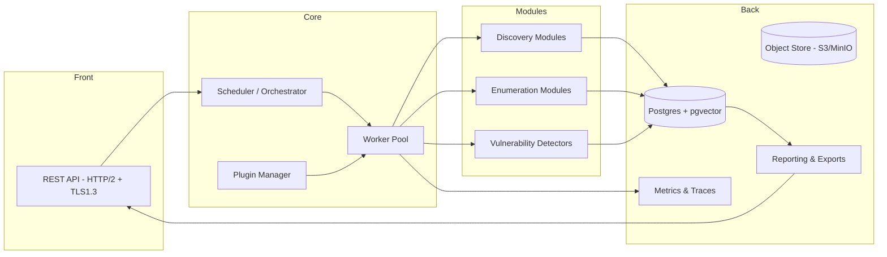
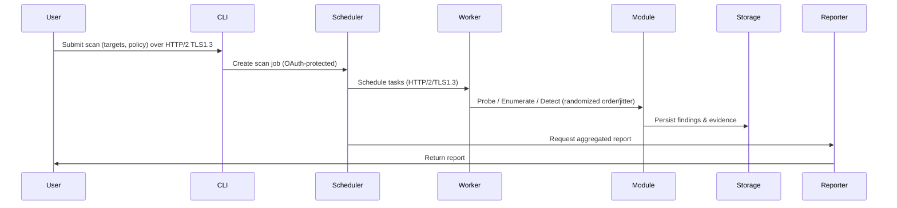

# Hela — Architecture Overview

This document describes the high-level architecture for Hela (Vanopticon), updated to enforce strict transport and security requirements: all service endpoints use REST over HTTP/2 with TLS 1.3, OAuth2 Client Credentials for authentication, no use of localhost/127.0.0.1 for service binding, and OS-trusted CAs only.

## Goals (updated)

- High-throughput, asynchronous scanning using Tokio
- Strong transport & auth guarantees: HTTP/2 + TLS 1.3, OAuth2 client credentials
- No gRPC usage; REST-only API surface
- No local/self-signed certificates; trust only the OS trust store
- Randomized scanning to reduce fingerprintability

## High-Level Components

- CLI / API: REST-over-HTTP/2 user-facing entrypoints to schedule scans and retrieve reports. Authentication via OAuth2 Client Credentials.
- Scheduler / Orchestrator: accepts scan plans, shards work, checkpoints progress. Scheduler and API communicate over HTTP/2 TLS 1.3.
- Worker Pool: concurrent workers that execute probes and detectors; workers must be able to run remotely and communicate over HTTP/2/tls1.3.
- Discovery Modules: host/service discovery (TCP, UDP, ICMP, banner analysis) with randomized probe ordering and jitter.
- Enumeration Modules: protocol-aware enumerators (HTTP, SSH, SMB, RDP, LDAP, etc.). All outbound probes must follow randomization and rate-limit policies.
- Detectors: vulnerability and PoV modules that validate findings non-destructively and cover the wide spectrum of scan types listed in the baseline README (buffer overflow, logic flaws, serialization issues, kernel/C code, cryptography, session management, ACLs, etc.). These detectors are organized into specialized pipelines (memory safety, binary exploitation, protocol misuse, configuration drift) that feed the reporting layer.
- Plugin Manager: loads and supervises extension modules; plugins run with capability restrictions and follow same transport & TLS rules for any networking.
- Storage: Postgres (with pgvector) for findings and metadata; artifact storage via object store with signed, time-limited URLs.
- Scan Set Service: manages configurable scan sets/profiles, publishes depth/detectability/risk metadata, and exposes the REST/CLI endpoints described in `docs/design/scan-sets.md`.
- Reporting: report generation, exports, and integrations.
- Observability: Prometheus metrics, OpenTelemetry traces (exported to configured backends over TLS 1.3).

## Component Diagram

## Sequence: A Scan Run (high-level)

  When a CLI invocation specifies a custom `scan_set` (see `docs/design/scan-sets.md`), the CLI first retrieves the set metadata, displays the depth/detectability/risk ratings, and then includes `scan_set_name` in the job creation payload so the scheduler enforces the configured pipelines, limits, and randomization hints.

    ## Use Cases

    - **Default scan for IP or range**: Client posts targets; scheduler applies default policy (discovery, enumeration, standardized detection pipelines). Workers obey HTTP/2+TLS1.3, randomization, and non-destructive constraints. Reporting aggregates CVE/CWE findings, signs artifacts, and serves the summary via OAuth-protected exports.
    - **Complete scan for a single IP**: A single IP with the “complete” policy flag triggers every detection pipeline (memory, protocol, config, session, network, privilege). Workers run deep probes while randomization ensures unpredictable timing. Outputs include detailed readout with proofs, CVE links, and prioritized mitigations.
    - **Deep disruptive scan with permission**: With explicit permission scope, scheduler enables disruptive modules (privilege escalation, kernel checks). Workers still communicate over HTTP/2+TLS1.3, but may stress targets; evidence persists in Postgres/object store and report downloads remain OAuth protected.
    - **Fast CVE-focused scan for IP or range**: Scheduler limits work to high-severity/common CVE detectors, favors heuristics, and compresses timing windows while randomness maintains variability. Report surfaces the most critical CVEs with confidence scores for rapid response.

    ## Scan Sets & Policy Profiles

    - Scan sets are named profiles that map to (or extend) the `default`, `complete`, `deep`, and `fast` policies but expose the depth, detectability, target risk, and operator risk metadata described in `docs/design/scan-sets.md`.
    - Each set binds the scheduler to a subset of detection pipelines, rate limits, randomization presets, and evidence retention windows, making it safe to run either aggressive or conservative scans depending on organizational risk posture.
    - The scheduler, CLI, and reporting layers log the selected set name and its metadata so audits can show which detectors were enabled and why the depth/risk ratings were chosen.
    - Custom sets also enforce OAuth scopes (`requires_scope`) so only operators with the appropriate privileges can launch high-impact scans.

## Concurrency, Resilience & Operational Constraints

- Scheduler shards the scope into segments and assigns them to workers using HTTP/2 connections.
- Workers operate asynchronously (Tokio) and obey rate limits and jitter to avoid fingerprintable patterns.
- All secrets that are generated by the service (session signing keys, ephemeral API keys) MUST be regenerated at startup and never persisted.
- A service restart MUST invalidate all sessions/tokens that are dependent on ephemeral keys. Persistent OAuth clients (third-party clients) remain valid as issued by the authorization server.
- Services MUST not bind to `localhost` or `127.0.0.1`. Deployments must use routable hostnames or IPs whose TLS certificates chain to an OS-trusted root.

## Plugin & Extension Model (constraints)

- Plugins must follow the same transport and TLS rules for any networked behavior.
- Plugins are restricted by capability and runtime execution limits; sandboxing approach should be chosen such that it does not permit bypassing TLS/CA constraints.

## Storage & Evidence

- Postgres stores normalized findings and metadata. Use `pgvector` for embeddings if ML/triage features are added.
- Object store used for artifacts; all artifact access is mediated by signed, time-limited URLs and requires valid OAuth tokens when proxied by Hela.

## Scan Coverage & Detection Pipelines

- Hela’s detection pipelines map directly to the expanded scan list in the README. Modules are grouped by technique:
    + **Memory & Binary Safety**: Buffer overflow, underflow, use-after-free, kernel/code vulnerabilities, process injection.
    + **Protocol & Serialization**: Deserialization bugs, template injection, insecure command invocation, sandbox escape.
    + **Configuration & Trust**: ACL misconfigurations, incorrect permission assignment, insecure defaults.
    + **Token, Session & Crypto**: Hardcoded credentials, flawed cryptography, flawed token validation, insecure session management.
    + **Network & Transport**: Insecure communications, failure to restrict URL access, insufficient transport layer protection.
    + **Platform/Privilege**: SUID/SGID issues, sandbox escape behavior, kernel privilege escalation checks.

- Each pipeline is composed of dedicated probes, protocol fuzzers, and heuristics that reuse the worker pool, plugin manager, and randomization infrastructure so the additional scans do not require bespoke scheduling logic.
- Findings from these pipelines are merged into a common evidence model for storage, which includes severity scoring, proof artifacts, and prioritized remediation guidance.

## Reporting & Prioritization

- Reporting aggregates the evidence from every detection pipeline, enriches it with CVE/CWE metadata, maps it to the scan type taxonomy (buffer overflow, session management, ACL, etc.), and ranks findings by severity, confidence, and remediation effort.
- Prioritization rules respect policy directives (e.g., skip high-impact probes against out-of-scope assets) and highlight configuration drift or misuse patterns before lower-confidence heuristic matches.

## Observability & Telemetry

- Prometheus metrics exported over HTTPS endpoints (HTTP/2 + TLS1.3) where applicable, or scraped through an authenticated metrics proxy.
- OpenTelemetry traces sent to configured collectors over TLS 1.3.

## Randomization Strategy (detailed)

- RNG: use a per-process CSPRNG seeded from the OS (do not persist seeds). Optionally derive a per-scan nonce from the process RNG for additional variability.
- Ordering: randomize target ordering and shard assignment where possible while keeping checkpointing.
- Timing: apply jitter to inter-probe delays; use randomized backoff and randomized scheduling windows.
- Packet variability: vary benign fields such as source ports and small payload variations to avoid identical fingerprint patterns.
- Safety: randomization MUST NOT cause policy violations (e.g., skipping required checks or violating target-safe modes). Randomization parameters must be configurable and limited by policy.

## Formal Models

- **Security Model**: Define the system as tuple $(	ext{Clients}, 	ext{Auth}, 	ext{Secrets})$ where $	ext{Clients}$ are OAuth2 actors, $	ext{Auth}$ is the Client Credentials grant, and $	ext{Secrets}$ is the set of server-generated keys. Invariant:
  $$orall c \\in \text{Clients}, \text{token}(c) \text{ valid } \implies \text{scope}(c) \subseteq \text{Scopes}_{\text{allowed}}$$
  and
  $$\text{sessionKey}_{\text{new}} \neq \text{sessionKey}_{\text{old}} \text{ after each restart}$$
  ensuring replay-immunity and scope bounding.
- **Transport Model**: HTTP/2 + TLS1.3 forms the only channel set $T$. Let $C_{OS}$ be the OS-trusted CA roots. A connection $t \in T$ is valid iff $t$ negotiates TLS1.3 and presents a cert chain rooted in $C_{OS}$. Local loopbacks are excluded: $\text{addr}(t) \notin \{\text{localhost}, 127.0.0.1\}$.
- **Detection Pipeline Model**: Let $S$ be the scan taxonomy from the README, $S = \{\text{memory}, \text{protocol}, \text{config}, \text{session}, \text{network}, \text{privilege}\}$. Each scan run is a mapping $f : S \times W \rightarrow O$ where $W$ is the worker pool and $O$ is the set of findings. Randomization function $r : \mathbb{N} \rightarrow \text{ProbeParameters}$ seeds scheduling while preserving coverage, ensuring for any two runs $f_1, f_2$: $$\text{targets}(f_1) = \text{targets}(f_2) \land \text{distribution}(r_1) \approx \text{distribution}(r_2)$$ but not identical sequences, preventing fingerprinting.

## Security Considerations

- No self-signed certificates, ever. All TLS certs must be validated against the OS trust store.
- OAuth Client Credentials is the only accepted machine-to-machine auth method for Hela APIs.
- Secrets must be stored using OS-native secret stores where available and must not be world-readable.

## Acceptance Criteria

- The system accepts and processes scans over HTTP/2 + TLS 1.3 only.
- The system enforces OAuth2 Client Credentials for all endpoints.
- No service binds to `localhost`/`127.0.0.1`.
- Restarting the service regenerates ephemeral secrets and invalidates session tokens that depend on them.
- Randomization is present and validated by tests without breaking scan correctness.
- Reporting integrates the CVE/CWE mapping from these scan categories, ranks findings by confidence, and surfaces relevant mitigation steps (e.g., CVE references for template injection, config drift actions for ACL issues).

## Test Plan

- Unit tests for scheduler, worker, and plugin interfaces.
- Integration tests that verify TLS1.3 enforcement and OS-CA validation.
- OAuth integration tests validating scopes and token enforcement.
- Randomization tests to verify distribution characteristics and functional equivalence across multiple runs.

## Open Questions

- How will developer workflows handle local testing without `localhost`? Consider using a local DNS override and injected OS trust store entries under controlled development policies.
- Determine enterprise process for provisioning certificates that chain to OS-trusted roots for internal hostnames.
